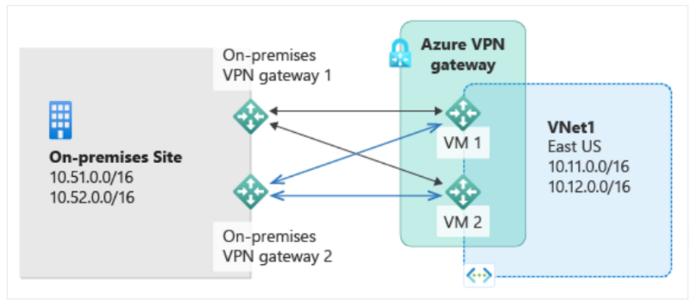
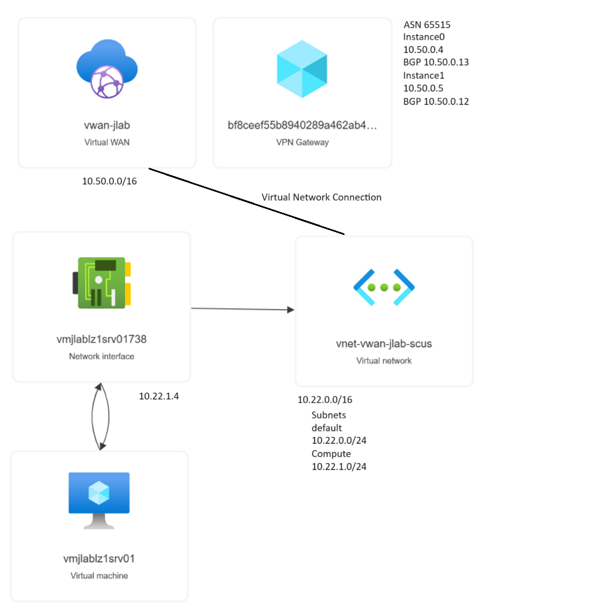
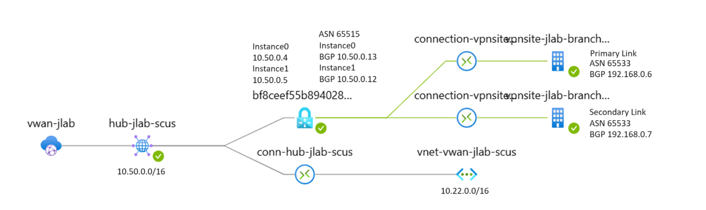
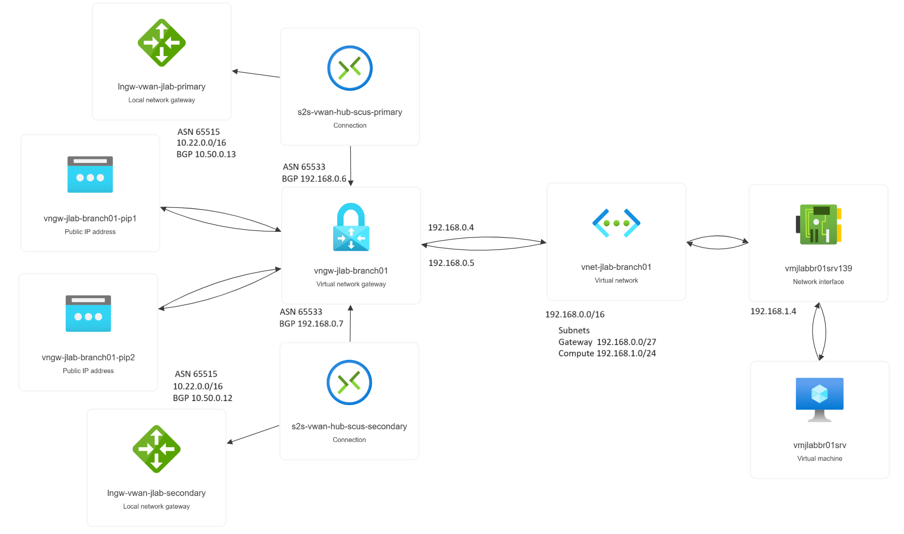
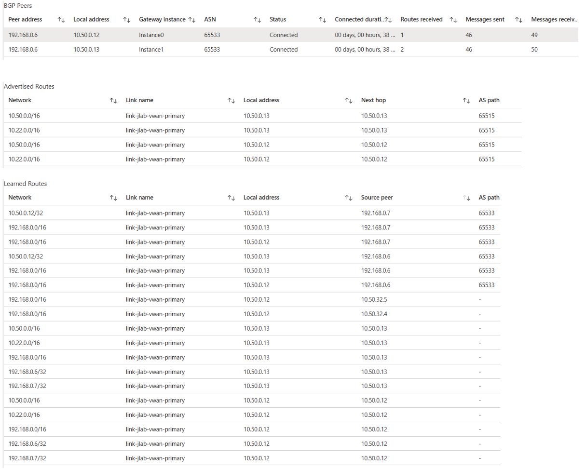
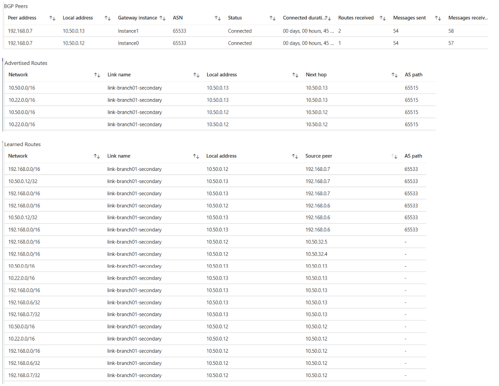
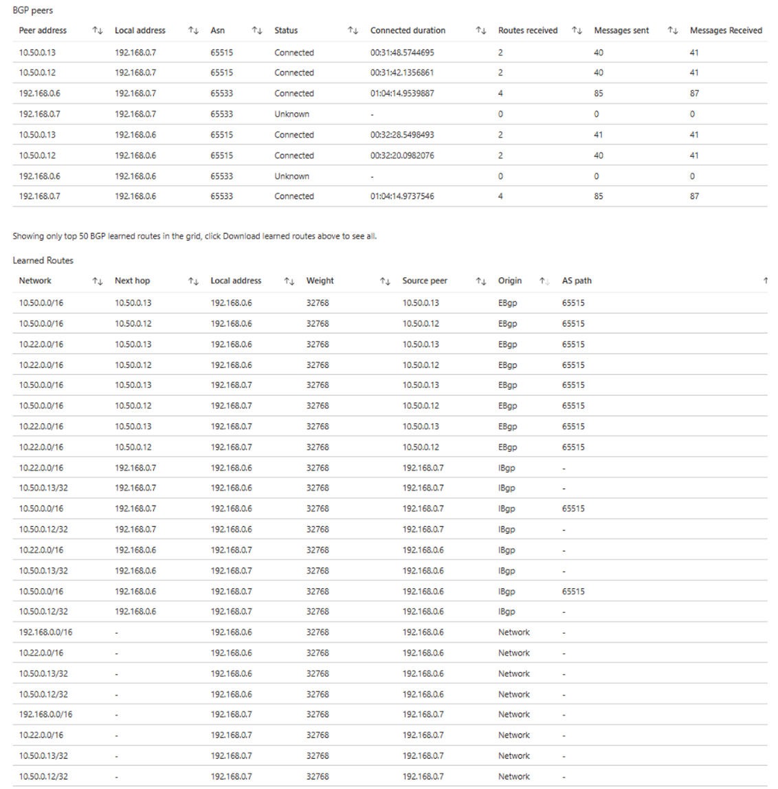

# vWan-Branch-Lab-Terraform

<!--
Link to the repository:
https://github.com/superjoe2000/vWan-Branch-Lab-Terraform/
-->

Terraform code to deploy a vWAN in Azure and a remote branch site with Active-Active VPN S2S connectivity

## File Organization

```bash
-VWAN-Branch-Lab-Terraform
  |-README.md
  |-images
    |-image1.png
    |-image2.png
    |-image3.png
    |-image4.png
    |-image5.png
    |-image6.png
    |-image7.png
  |-vWAN-Branch
    |-main.tf <--- Deployment entry point
    |-main.tfplan
    |-provider.tf
    |-terraform.tf
    |-terraform.tfstate
    |-terraform.tfstate.backup
  |-vWAN
    |-main.tf <--- Module
    |-main.tfplan
    |-provider.tf
    |-terraform.tf
    |-terraform.tfstate
    |-terraform.tfstate.backup
  |-On-prem-branch
    |-main.tf <--- Module
    |-main.tfplan
    |-provider.tf
    |-terraform.tf
    |-terraform.tfstate
    |-terraform.tfstate.backup
```

## Prerequisites

- Azure Subscription
- Terraform installed

## Deployment

The deployment is done from the main.tf in the vWAN-Branch directory.  The main.tf in the other directories (vWAN and On-Premises-Branch) are called as modules.

1. Clone the repository
2. cd ./vWAN-Branch
3. Run the following commands:

```bash
# Login to Azure
az login
az account list -otable
az account set --subscription <subscription_id or name>

# Initialize Terraform
terraform init -upgrade
# Plan the deployment
terraform plan -out main.tfplan
# Apply the deployment
terraform apply main.tfplan
```

### Success

A successful deployment will show the following output:

```bash
Apply complete! Resources: 39 added, 0 changed, 0 destroyed.

Outputs:

brAsn = 65533
branch01_primary_bgp_address = "192.168.0.7"
branch01_primary_vpn_address = "[Dynamic publicIP]"
branch01_secondary_bgp_address = "192.168.0.6"
branch01_secondary_vpn_address = "[Dynamic publicIP]"
hubAsn = 65515
hubBgpPeeringAddress_primary = "10.50.0.12"
hubBgpPeeringAddress_secondary = "10.50.0.13"
hubGatewayAddress_primary = "[Dynamic publicIP]"
hubGatewayAddress_secondary = "[Dynamic publicIP]"
```

## Clean up

Run the following command:

```bash
terraform destroy
```

## Discussion

The current Azure VPN gateway is capable of providing Active-Active resiliency for critical Connections to an Azure VPN Gateway.  The capability uses two IPSEC tunnels from the on-premises site equipment to the Azure VPN Gateway.  BGP routing can then provide uninterrupted connectivity during failures for any reason for one of the IPSEC tunnels or supporting components in the path.  

The architecture is described in this Microsoft learn article:
[About Highly Available gateway configurations - Azure VPN Gateway | Microsoft Learn](https://learn.microsoft.com/en-us/azure/vpn-gateway/vpn-gateway-highlyavailable#dual-redundancy-active-active-vpn-gateways-for-both-azure-and-on-premises-networks).
It shows an Active-Active VPN Gateway in Azure connected to two routers in the on-premises site that are set up with BGP and form a highly resilient "bow-tie" connection path architecture.

There is a step-by-step guide to deploy using the Portal:
[Configure active-active VPN gateways: Azure portal - Azure VPN Gateway | Microsoft Learn](https://learn.microsoft.com/en-us/azure/vpn-gateway/active-active-portal).

This repository deploys a proof of concept in an Azure lab using vWAN VPN for the Azure side and an on-premises site deployed in another region using an Azure stand-alone VPN Gateway.  BGP is enabled on all the resources and the connections.  

I added virtual machines in both the Azure vWAN connected VNET and in the on-premises VNET.  I set up continuous ping from each VM to the other.  I failed various parts of the connections or gateway instances to see the effect.  Some failures resulted in no pings lost.  Other failures had drops of 2-5 pings to recover.  At the times that there were ping drops they only occurred in one of the VMs running the continuous ping.  The other VM never saw a drop.



### Here is the topology from the vWAN in Azure



The vWAN resource shows a detailed topology of its connections.



### Here is the topology of the on-premises site



### Here are the BGP peer lists from the vWAN

Primary:



Secondary:



### Here are the BGP peer lists from the on-premises VPN Gateway



---

> [!IMPORTANT]
> Remember to destroy the resources when you are done to avoid charges.
